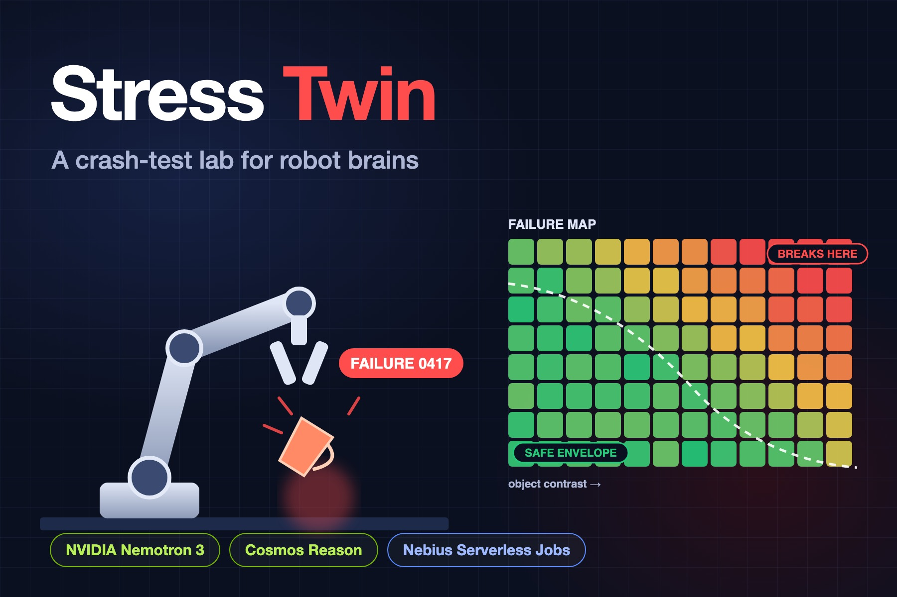

# Stress Twin

**A crash-test lab for robot brains.** Stress Twin takes a robot manipulation policy, attacks it
in simulation with adversarially chosen scenarios, explains every way it breaks, and writes a
safety case: an operating envelope that is validated on scenarios the search never saw.



Built for the Nebius × NVIDIA Global AI Hackathon 2026 (Physical AI track).
Sample report: [`docs/sample-report.html`](docs/sample-report.html).

## Why

Learned robot policies work in the scenes they were trained on and fail in surprising ways when
light, colour, mass or calibration drift. Self-driving has scenario-based safety testing; robot
manipulation mostly has demo videos. Stress Twin searches for the *mildest* change that breaks a
policy, because the subtle failures are the ones a lab demo never shows.

## What it does

1. **Simulates** a gantry robot with a force-limited parallel gripper picking a cube (MuJoCo).
   The policy under test is a CNN trained only on nominal scenes plus a scripted grasp.
2. **Searches** a 14-condition scenario space (lighting, object colour, mass, friction, size,
   rotation, distractors, camera calibration, sensor noise, bumps) for failures:
   - `boundary`: active learning. A random-forest surrogate predicts the failure *cause*;
     candidates are scored for closeness to the success/failure boundary, subtlety, and the
     chance of revealing a failure mode not yet seen, stratified across conditions.
   - `llm`: NVIDIA Nemotron on Nebius Token Factory acts as the adversary. Each round it reads
     the whole campaign state (per-condition breaking points, modes found, which of its last
     hypotheses were confirmed) and proposes falsifiable stress hypotheses.
   - `random`: the baseline a test engineer would write.
3. **Diagnoses** every failure deterministically from telemetry (perception miss, stale estimate
   after a bump, descent collision, grasp miss, slip) and attributes it to the condition that can
   physically cause it.
4. **Explains** each failure mode. With Token Factory, Nemotron 3 Nano Omni (or Cosmos3 Reasoner)
   reads the robot's view and side-view keyframes; its stated cause is checked against telemetry
   and any disagreement is flagged.
5. **Writes a safety case.** A PRIM box-peeling search finds the operating envelope, then
   `stress-twin validate` runs fresh held-out scenarios inside and outside it.

## Measured results (offline mode, this repository)

All numbers below come from the commands in this README on an Apple M1 Pro laptop (CPU only).

| Check | Result |
|---|---|
| Policy success in its nominal domain | 200 / 200 |
| Episode cost | about 0.06 s per episode per core |
| Demo campaign (`runs/demo`, 240 episodes, boundary search) | 72 failures, 14 failure modes, 5 root causes, 16 subtle failures |
| Safety envelope, held-out validation | 95.3% pass inside (n=150, 95% CI 90.7–97.7%) vs 34% outside (n=50), 0 scenarios shared with the campaign |
| Container worker vs local run (24 episodes) | 24 / 24 same outcome and cause; perception estimates within 1 mm |

Boundary search vs random stress testing, mean of 3 seeds:

| Budget | Subtle failures (stress ≤ 0.30) | Distinct failure modes |
|---|---|---|
| 120 episodes | 8.0 vs 4.3 | 11.7 vs 13.3 |
| 240 episodes | 27.0 vs 7.0 | 15.7 vs 15.7 |
| 480 episodes | 55.3 vs 10.7 | 18.7 vs 18.3 |

Boundary search finds 2–5× more subtle failures, and the gap grows with budget. On distinct
failure modes it is at parity: both strategies find all common modes, and the remaining modes
occur 1–5 times in 3,000 random episodes (`scripts/mode_universe.py`).

## NVIDIA and Nebius components

| Component | Where | Status |
|---|---|---|
| **NVIDIA Nemotron 3 Ultra** (planner role, falls back to Nemotron 3 Super) | `stress_twin/llm_strategy.py` adversary, via `stress_twin/llm.py` | Implemented; tested end to end against an OpenAI-compatible mock of Token Factory. Not yet run against the live API from this repo. |
| **NVIDIA Nemotron 3 Nano Omni / Cosmos3-Super-Reasoner** (vision role) | `stress_twin/analyst.py` failure captions with grounding check | Same as above. |
| **Nemotron 3.5 Lightning** (fast role) | routed in `stress_twin/llm.py` | Discovered and routed; no feature depends on it yet. |
| **Nebius Token Factory** (OpenAI-compatible API, `json_schema` structured output, image input) | `stress_twin/llm.py` | Model ids discovered from `/v1/models` at runtime; every call logged with tokens and latency to `llm_calls.jsonl` and shown in the report. |
| **Nebius Serverless Jobs** | `stress_twin/nebius_jobs.py`, `stress_twin/worker.py`, `Dockerfile` | Uses the documented `nebius ai create --type job` CLI. Tested with a fake CLI; worker image built and verified locally with Docker. Not yet run on a live Nebius account. |

Without `NEBIUS_API_KEY`, everything runs offline and the report says so in its header.

## Quick start (offline)

```bash
uv venv --python 3.11 .venv && source .venv/bin/activate
uv pip install -e ".[dev]"
stress-twin run --budget 240 --rounds 4 --strategy boundary --out runs/demo
stress-twin validate --run runs/demo --n 150
stress-twin report --run runs/demo        # rebuilds report.html with the validation result
open runs/demo/report.html
```

Other commands: `stress-twin nominal` (policy competence), `stress-twin surface` (failure causes
under random stress), `stress-twin benchmark --budget 240 --seeds 3`, `stress-twin selftest`.

## Live mode (Nebius Token Factory)

```bash
export NEBIUS_API_KEY=...            # from https://tokenfactory.nebius.com
stress-twin run --strategy llm --analyst llm --budget 120 --rounds 4 --out runs/live
```

Override model choice with `STRESS_TWIN_PLANNER_MODEL`, `STRESS_TWIN_VISION_MODEL` or
`STRESS_TWIN_FAST_MODEL`, and the endpoint with `NEBIUS_BASE_URL`.

## Scaling out on Nebius Serverless Jobs

```bash
docker build --platform linux/amd64 --build-arg MUJOCO_VERSION=3.15.0 -t <registry>/stress-twin:0.1 .
docker push <registry>/stress-twin:0.1
stress-twin run --runner nebius --image <registry>/stress-twin:0.1 --batch-size 40 --out runs/cloud
stress-twin run --runner nebius --dry-run --budget 40 --rounds 1 --out runs/dry   # print job commands, run worker locally
```

Each batch of episodes becomes one job; results return through job logs, so no bucket is needed.
The default platform `cpu-d3` and preset `16vcpu-64gb` are assumptions, not verified against a live
project: set `STRESS_TWIN_PLATFORM` and `STRESS_TWIN_PRESET` to a CPU platform and preset your
Nebius project offers.

## Retraining the policy's perception

```bash
python -m stress_twin.train_perception --n 6000 --epochs 40
```

Trains on nominal scenes only (about 6 minutes on CPU). The shipped weights reach 1.1 mm mean
error on nominal validation images. `failures.jsonl` in every run is a replayable set of
failure scenarios to extend the training data with.

## Limitations

- The robot is a simulated Cartesian gantry, and the policy is a small CNN plus a scripted grasp,
  chosen so the whole loop runs on a laptop. Plugging in a GR00T or LeRobot policy means
  replacing `stress_twin/episode.py`'s policy calls; that adapter does not exist yet.
- Episodes are bit-for-bit deterministic within one environment. Across OpenGL backends the
  perception image differs slightly; outcomes agree in testing, and the report flags any replay
  whose cause changed.
- The envelope is axis-aligned. Interactions inside it show up as residual risk, which the
  report lists from the validation run.

## Tests

```bash
pytest -q
```

22 tests cover parameters, deterministic replay, diagnosis, the Token Factory client against a
mock server, a full LLM campaign with grounded captions, the Serverless Jobs runner with a fake
`nebius` CLI, and the envelope analysis.

## License

Apache-2.0. See [LICENSE](LICENSE).
